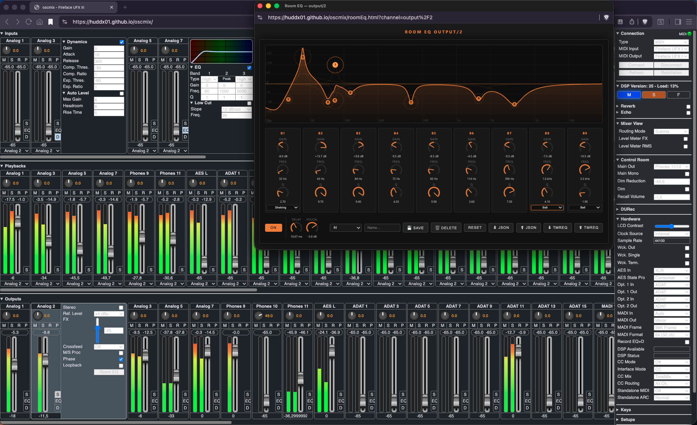

[](https://github.com/huddx01/oscmix/actions/workflows/build.yml)

⚠️ Note

You have reached my dev branch which is a fork of https://github.com/michaelforney/oscmix.

Keep in mind that this content may be untested/experimental/wip state.


# oscmix
 
oscmix implements an OSC API for some RME's Fireface units running in
class-compliant mode, allowing full control of the device's
functionality through OSC on POSIX operating systems supporting USB
MIDI.

## Current status

Most things work, but still needs a lot more testing, polish,
cleanup. Some things still need to be hooked up in the UI or
implemented in oscmix.

### Supported devices

- RME Fireface UCX II

### Devices in WIP State

- RME Fireface 802
- RME Fireface UCX
- RME Fireface UFX+
- RME Fireface UFX II
- RME Fireface UFX III


## Download

Pre-Compiled binaries are available for arm64 and x86_64 architectures.
Each arch is available for linux and darwin (macOS).

Check the release section at: https://github.com/huddx01/oscmix/releases

## Building

If you prefer building your own from the sources, follow the steps below...

### 1. Install Dependencies

#### For Debian/Ubuntu:
```shell
sudo apt update
sudo apt install -y libasound2-dev pkg-config libgtk-3-dev libglib2.0-dev clang lld git
```
#### For Darwin(macOS):
**TODO** Document the dependencies for macOS here.

### 2. Download Repository
First, decide which repo/branch fits your needs/unit.

- 2a) If you want use this repo's dev branch:
```shell
git clone https://github.com/huddx01/oscmix.git
cd oscmix
git switch dev
```
- 2b) Or, if you want use 
[michaelforney](https://github.com/michaelforney)’s original repo: 
```shell
git clone https://github.com/michaelfourney/oscmix.git
cd oscmix
```

### 3. Build
From the oscmix dir, use make to build the binaries.
```shell
make oscmix
make alsaseqio
make alsarawio
make gtk
make tools/regtool
```
If you want to build the wasm too (needed for own webserver), you'll need additional dependencies. 
See: https://github.com/huddx01/oscmix/tree/dev?tab=readme-ov-file#web-ui

## General Oscmix Usage

```
oscmix [-dl] [-r recvaddr] [-s sendaddr]
```

oscmix reads and writes MIDI SysEx messages from/to file descriptors
6 and 7 respectively, which are expected to be opened.

By default, oscmix will listen for OSC messages on `udp!127.0.0.1!7222`
and send to `udp!127.0.0.1!8222`.

See the manual, [oscmix.1], for more information.

[oscmix.1]: https://michaelforney.github.io/oscmix/oscmix.1.html

## Running

### Linux

On Linux systems, you can use alsarawio or asaseqio to run oscmix.

#### 1. alsarawio

On Linux systems, you can use bundled `alsarawio` program open and
configure a given raw MIDI subdevice and set up these file descriptors
appropriately.

To determine your MIDI device, look for it in the output of `amidi -l`.
(the last ending port with the name `Fireface xyz...`).

Example:

```sh
$ amidi -l
Dir Device    Name
IO  hw:0,0,0  Fireface UFX III (xxxxxxxx) Por
IO  hw:0,0,1  Fireface UFX III (xxxxxxxx) Por
IO  hw:0,0,2  Fireface UFX III (xxxxxxxx) Por
IO  hw:0,0,3  Fireface UFX III (xxxxxxxx) Por
```

We use the last port from the result above to run oscmix:

```sh
alsarawio 0,0,3 oscmix
```


#### 2. alsaseqio

There is also a tool `alsaseqio` that requires alsa-lib and uses
the sequencer API.

To determine the client and port for your device, find the client
and the last port in the output of `aconnect -l` for your device.

Example:
```sh
$ aconnect -l
...
client 16: 'Fireface UFX III (xxxxxxxx)' [type=Kernel,card=0]
    0 'Fireface UFX III (xxxxxxxx) Por'
    1 'Fireface UFX III (xxxxxxxx) Por'
    2 'Fireface UFX III (xxxxxxxx) Por'
    3 'Fireface UFX III (xxxxxxxx) Por'
...
```
We use the client and last port from the result above to run oscmix:
```sh
alsaseqio 16:3 oscmix
```

### BSD

On BSD systems, you can launch oscmix with file descriptors 6 and
7 redirected to the appropriate MIDI device.

For example:

```sh
oscmix 6<>/dev/rmidi1 7>&6
```

### macOS (Darwin)

On macOS (Darwin) systems, you can build and launch oscmix, too.

At least, Xcode Command Line Tools are neccesary (not needed if you have Xcode installed). 

You can install the Xcode Command Line Tools via:

```sh
xcode-select --install
```

Afterwards, go to the cloned oscmix directory (assure you are on dev branch) and buid oscmix via:

```sh
make oscmix
```

Additionally you need to build coremidiio via: 

```sh
make coremidiio
```

If this is done, check your port number and remember the exact name of your unit:

```sh
./coremidiio -l
```

For example, if your unit would appear like this...
"4  	Fireface 802 (12345678) Port 2"
...the corresponding command would be:

```sh
./coremidiio -f 6,7 -p 4 ./oscmix -p 'Fireface 802 (12345678) Port 2'
```
Note: you can also set MIDIPORT env variable to 'Fireface 802 (12345678) Port 2' in this example.


## GTK UI

The [gtk](gtk) directory contains oscmix-gtk, a GTK frontend that
communicates with oscmix using OSC.


### Running GTK UI
To run oscmix-gtk without installing, set the `GSETTINGS_SCHEMA_DIR`
environment variable.

```sh
GSETTINGS_SCHEMA_DIR=$PWD/gtk ./gtk/oscmix-gtk
```

## Web UI

The [web](web) directory contains a web frontend that can communicate
with oscmix through OSC over a WebSocket, or by directly to an
instance of oscmix compiled as WebAssembly running directly in the browser.




The web UI for this fork/dev branch is automatically deployed at
[https://huddx01.github.io/oscmix](https://huddx01.github.io/oscmix).

It is tested primarily against the chromium stable channel, but
patches to support other/older browsers are welcome (if it doesn't
complicate things too much).

Also included is a UDP-to-WebSocket bridge, `wsdgram`. It expects
file descriptors 0 and 1 to be an open connection to a WebSocket
client. It forwards incoming messages to a UDP address and writes
outgoing messages for any UDP packet received. Use it in combination
with software like [s6-tcpserver] or [s6-tlsserver].

```sh
s6-tcpserver 127.0.0.1 8222 wsdgram
```

To build `oscmix.wasm`, you need `clang` supporting wasm32, `wasm-ld`,
and `wasi-libc`.

[s6-tcpserver]: https://skarnet.org/software/s6-networking/s6-tcpserver.html
[s6-tlsserver]: https://skarnet.org/software/s6-networking/s6-tlsserver.html

## OSC API

The OSC API is not yet final and may change without notice.

| Method | Arguments | Description |
| --- | --- | --- |
| `/input/{1..20}/mute` | `i` enabled | Input *n* muted |
| `/input/{1..20}/fxsend` | `f` db (-65-0) | Input *n* FX send level |
| `/input/{1..20}/stereo` | `i` enabled | Input *n* is stereo |
| `/input/{1..20}/record` | `i` enabled | Input *n* record enabled |
| `/input/{1..20}/playchan` | `i` 0=off 1-60 | Input *n* play channel |
| `/input/{1..20}/msproc` | `i` enabled | Input *n* M/S processing enabled |
| `/input/{1..20}/phase` | `i` enabled | Input *n* phase invert enabled |
| `/input/{1..4}/gain` | `f` 0-75 (n=1,2) 0-24 (n=3,4) | Input *n* gain |
| `/input/{1..2}/48v` | `i` enabled | Input *n* phantom power enabled |
| `/input/{3..8}/reflevel` | `i` 0=+4dBu 1=+13dBu 2=+19dBu | Input *n* reference level |
| `/durec/status` | `i` | DURec status |
| `/refresh` | none | **W** Refresh device registers |
| `/register` | `ii...` register, value | **W** Set device register explicitly |

**TODO** Document rest of API. For now, see the OSC tree in `oscmix.c`.

## Contact

There is an IRC channel #oscmix on irc.libera.chat.
